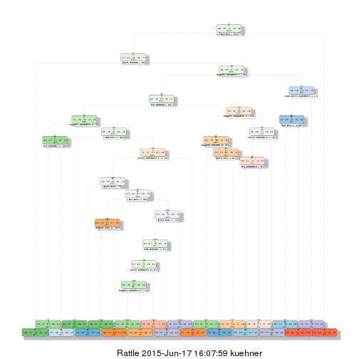
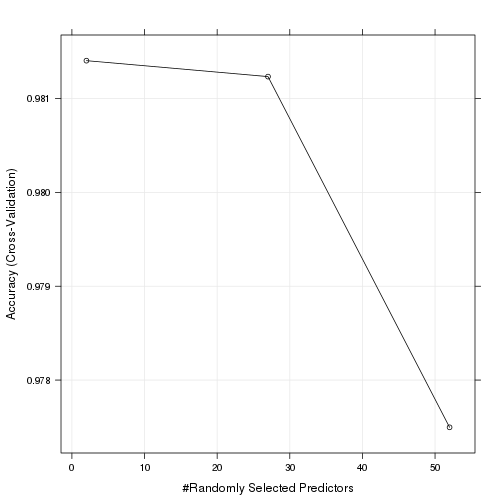

# Practical Machine Learning Project
##  Abstract

This is the Writeup of the Practical Machine Learning Peer Assessment.
We do some preprocessing on the pml-training file, build tree based models, use cross validation, compute out of sample error and predict test cases on the pml-testing set. 

## Preprocessing

We load the files pml-training.csv and pml-testing.csv into R and do some cleaning. Inspecting the training file, we find that there are 19622 observations of 160 variables. In one hundred of these variables 90 percent or more observations
are not available (NA). We drop these variables and result in a data set training with 19622 observations of 60 variables.
The first seven variables of the training set contain observations not relevant for modeling and are dropped. We finally have a training set with 11776 observations of 53 variables. 


We split this training set with the createDataPartition() function from the caret package
into two parts. One, again called training, containing 80 percent of the data,
actually used for modeling, the 
rest, called validation, for cross validation of the models.

The r-code for this preprocessing is not included in this report. You may find it in the file
preProject.r of the master branch of the github.com/jrkuehner/jrkuehner.github.io repository.

## Tree Based Model with Package rpart

We load the rpart library and construct a decision tree on the training set
with the rpart() function. The default option control = rpart.control() includes
10 fold cross validation.


We plot the decision tree.


```r
trellis.par.set(caretTheme())
fancyRpartPlot(fitTree)
```

 


We compute the in sample error manually.


```r
inerr = 1 - sum(predictTrain == training$class)/ length(training$class); inerr
```

```
## [1] 0.2518682
```

We compute the out sample error manually.


```r
outerr = 1 - sum(predictValid == validation$class)/ length(validation$class); outerr
```

```
## [1] 0.2542626
```

We also made a manual cross validation.
The r-code can be found in the file
rpart.r of the master branch of the github.com/jrkuehner/jrkuehner.github.io repository.
This time the in sample error was 0.2573 whereas the out sample error was 0.2648.

We predict on the testing data.


```r
testPredictTree = predict(fitTree, newdata = pml.testing, type = "class"); testPredictTree
```

```
##  1  2  3  4  5  6  7  8  9 10 11 12 13 14 15 16 17 18 19 20 
##  B  A  E  D  A  C  D  A  A  A  C  E  C  A  E  E  A  B  B  B 
## Levels: A B C D E
```


## Random Forest Model with Package caret

We wanted to try random forest modeling. We apply the train() function
with the training data, method "random forest" and trControl option "cross validation".


```r
forest = train(class ~ ., data = training, method = "rf",
trControl = trainControl(method = "cv", number = 2, allowParallel = TRUE))
```


```r
forest$finalModel
```

```
## 
## Call:
##  randomForest(x = x, y = y, mtry = param$mtry) 
##                Type of random forest: classification
##                      Number of trees: 500
## No. of variables tried at each split: 2
## 
##         OOB estimate of  error rate: 0.87%
## Confusion matrix:
##      A    B    C    D    E class.error
## A 3343    2    1    1    1 0.001493429
## B   19 2254    6    0    0 0.010969724
## C    0   21 2031    2    0 0.011197663
## D    0    0   37 1891    2 0.020207254
## E    0    0    3    8 2154 0.005080831
```
It may be informative to have a plot of accuracy against randomly selected predictors. 


```r
trellis.par.set(caretTheme())
plot(forest)
```

 


The model predicts well on the training data. We do not show the output here.

```r
predictForest = predict(forest, newdata = training)
confusionMatrix(predictForest, training$class)
```

We verify prediction on the validation data.


```r
predictValid = predict(forest, newdata = validation)
confusionMatrix(predictValid, validation$class)
```

```
## Confusion Matrix and Statistics
## 
##           Reference
## Prediction    A    B    C    D    E
##          A 1346    0    0    0    0
##          B    0  904    0    0    0
##          C    0    0  814    0    0
##          D    0    0    0  774    0
##          E    0    0    0    0  854
## 
## Overall Statistics
##                                      
##                Accuracy : 1          
##                  95% CI : (0.9992, 1)
##     No Information Rate : 0.2869     
##     P-Value [Acc > NIR] : < 2.2e-16  
##                                      
##                   Kappa : 1          
##  Mcnemar's Test P-Value : NA         
## 
## Statistics by Class:
## 
##                      Class: A Class: B Class: C Class: D Class: E
## Sensitivity            1.0000   1.0000   1.0000    1.000    1.000
## Specificity            1.0000   1.0000   1.0000    1.000    1.000
## Pos Pred Value         1.0000   1.0000   1.0000    1.000    1.000
## Neg Pred Value         1.0000   1.0000   1.0000    1.000    1.000
## Prevalence             0.2869   0.1927   0.1735    0.165    0.182
## Detection Rate         0.2869   0.1927   0.1735    0.165    0.182
## Detection Prevalence   0.2869   0.1927   0.1735    0.165    0.182
## Balanced Accuracy      1.0000   1.0000   1.0000    1.000    1.000
```

Finally we predict on the testing data.

```r
predict(forest, pml.testing)
```

```
##  [1] B A B A A E D B A A B C B A E E A B B B
## Levels: A B C D E
```

This is what we will submit in the second part of the assessment.

